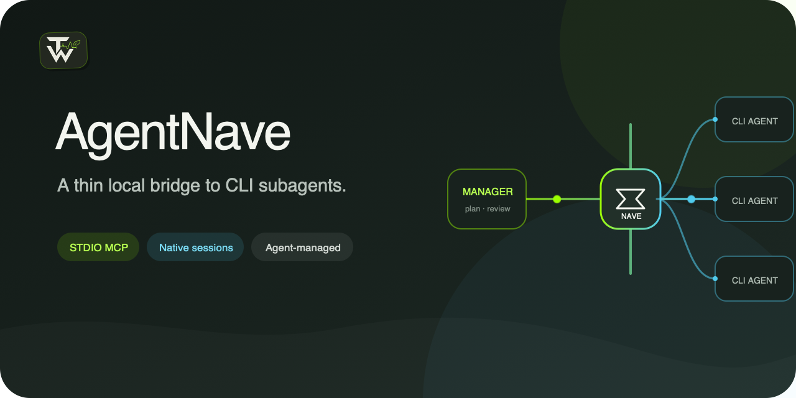

# AgentNave

<p align="center">
  
</p>

**A thin local bridge from Agent Managers to CLI subagents.**

AgentNave lets an Agent Manager launch Antigravity CLI, Claude Code, CodeBuddy Code, Codex CLI, or
Grok CLI through three lifecycle tools and one read-only provider-description tool. Each provider keeps its native authentication,
configuration, permissions, and session model; AgentNave supplies the adapter and process
supervision around it.

The boundary is intentional. AgentNave does not plan tasks, assign roles, build DAGs, choose
parallelism, review results, synthesize answers, retry work, or manage worktrees. Those decisions
belong to the calling Agent Manager, where the full task context already exists.

AgentNave has no human-facing CLI. The `agentnave-mcp` command is only the STDIO entry point used by
a compatible MCP host.

## What AgentNave owns

| AgentNave | Calling Agent Manager |
| --- | --- |
| Provider command adapters | Planning and task decomposition |
| In-memory invocation lifecycle | Provider and model selection |
| POSIX process-group supervision | Parallelism, review, and synthesis |
| Normalized terminal results | Retries, permissions, and worktrees |

## Requirements

- macOS or Linux
- `uv` and Git (for installation from a release tag)
- At least one authenticated provider CLI

`uv` installs AgentNave in an isolated Python 3.12 environment. A separately managed system
Python is not required.

AgentNave supports POSIX process supervision on macOS and Linux. Native Windows support requires
Job Object ownership first.

## Install

Install the `agentnave-mcp` runtime and register it in your MCP host. Model-selection guidance,
lifecycle instructions, and tool schemas are delivered through MCP; no Skill is required.

Install the runtime with `uv tool` so the MCP launcher does not depend on a source checkout:

```bash
uv tool install --python 3.12 \
  "git+https://github.com/TimWongUp/agentnave.git@v0.5.0"
```

Keep the release tag in the install source rather than replacing it with the mutable `main` branch.
`uv` owns the isolated runtime, launcher, upgrades, and removal; it does not modify host Skills,
global instructions, permissions, or provider configuration.

Then register the runtime with a host-specific `AGENTNAVE_EXCLUDED_PROVIDERS` environment value:
Codex hosts exclude `codex`, Claude Code hosts exclude `claude`, and other matching hosts exclude
their corresponding CLI provider. The server rejects excluded providers before creating an
invocation. The detailed guide covers:

- Codex;
- Claude Code;
- Gemini CLI;
- OpenCode; and
- other agents that support local STDIO MCP servers.

[Read the installation guide](docs/installation.md) for host-specific MCP registration, provider
exclusions, verification, upgrades, and removal.

AgentNave creates no durable user data. Provider authentication and configuration remain owned by
their respective CLIs.

## The MCP surface

The interface below is available in `v0.5.0`. After upgrading from `v0.4.0` or earlier,
restart the MCP connection so the host discovers `describe_provider`.

AgentNave exposes four tools. The initial tool metadata contains a compact provider directory;
model defaults and provider-specific options are returned only when requested.

### `describe_provider`

Call with the selected `provider` before its first use in the current context. Returns that
provider's permitted status, model/effort defaults, supported options, and override guidance.
Reuse the result for later calls with the same provider. This tool neither launches a CLI nor
checks installation or authentication; it does not consume provider quota or change the tool list.

For example: `describe_provider({"provider": "grok"})` → `start_agent(...)` → `wait_agent(...)`.

### `start_agent`

Starts one provider invocation and immediately returns an in-memory `invocation_id`. It requires
`provider`, `prompt`, and an absolute existing `cwd`; `session_id`, `timeout_seconds`, and explicit
`provider_options` are optional.

Supported providers are `antigravity`, `claude`, `codebuddy`, `codex`, and `grok`. `describe_provider` provides model and effort defaults for the Manager to pass explicitly through
allowlisted options. User choices override that guidance; omitted options still inherit native
settings. Exclusions are configured per host process, independently of the model it uses. For Codex calls outside a
Git repository, the Manager must pass
`{"skip_git_repo_check": true}` in `provider_options`.

### Choosing a model and reasoning effort

To override the defaults for one task, tell your calling Agent the provider, model ID, and
reasoning effort. For example: “Use Codex CLI with model `gpt-6-astra` and effort `medium`.”
The Agent passes `{"model": "gpt-6-astra", "effort": "medium"}` in `provider_options`.
Only specified fields override the MCP guidance. To keep your choices across tasks, put the
same preference in your calling Agent's personal instructions. To use the CLI's native settings,
explicitly ask the Agent to omit the corresponding options.

When a new model becomes available, use its exact ID from that provider's model list; updating
AgentNave is not required to pass a new model ID. If you maintain a source installation and want
to change the bundled defaults, edit `_MODEL_DEFAULTS` in `src/agentnave/mcp_server.py`, then
restart the MCP connection so the calling Agent receives the updated instructions. An unavailable
model should be reported rather than silently replaced.

### `wait_agent`

Waits for at most `wait_timeout_seconds`. A `running` response keeps the invocation active and
includes a lifecycle snapshot; a `finished` response contains the normalized provider result.

### `cancel_agent`

Stops an invocation and returns its terminal result. Use it only when the Manager intends to end
active provider work; `wait_agent` observes without cancelling.

All four tools publish input and output JSON Schemas. Agent-correctable request errors are MCP Tool
errors with retry guidance; provider launch and execution outcomes remain structured Invocation
Results.

## Lifecycle and security

Invocation handles live only in the current MCP server process. When the server stops, AgentNave
makes a best-effort attempt to terminate processes that remain in the provider process group. A
restart cannot recover old handles, but a retained provider `session_id` can be supplied to a new
`start_agent` call.

A running snapshot reports lifecycle phase, elapsed time, and the age of the latest official
provider stream event. It does not claim semantic task progress. Terminal `output` contains the
provider's final response rather than intermediate narration.

AgentNave is not a sandbox. A same-user provider with command permission can deliberately daemonize,
kill its supervisor, or otherwise escape ordinary POSIX process-group cleanup. Provider-native
permissions remain the security boundary; use OS-level isolation when adversarial containment is
required.

## Verify

These checks are for a development checkout, not the `uv tool` installation above. See
[CONTRIBUTING.md](CONTRIBUTING.md) for the complete contributor workflow.

```bash
uv sync --locked --all-groups
uv run ruff format --check .
uv run ruff check .
uv run pyright
uv run pytest
```

## Contributing and security

Contributions are welcome through GitHub Issues and pull requests. See
[CONTRIBUTING.md](CONTRIBUTING.md) for the development workflow and validation requirements.

Do not report security vulnerabilities in a public Issue. Follow [SECURITY.md](SECURITY.md) to use
the repository's private vulnerability reporting channel.

## License

AgentNave is licensed under the [MIT License](LICENSE).
